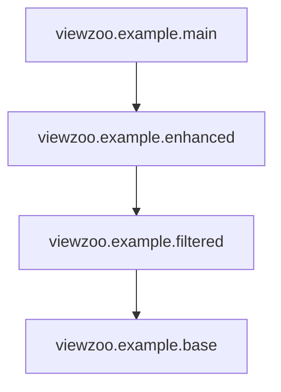

# viewzoo
This Trino connector stores **virtual views**, which allow improvising, extending, and re-platforming data sources while seamlessly preserving compatibility
with all applications. Virtual views are especially useful for prototyping, when updating existing applications to use Apache Iceberg, and for creating layered
hierarchies of views that can be swapped out at runtime. This connector stores virtual views to the Trino server's local filesystem, or to a local or remote
Postgresql database, without requiring any other infrastructure.

[](https://claude.ai/code)
[](https://www.codefactor.io/repository/github/robfromboulder/viewzoo)
[](https://github.com/robfromboulder/viewzoo/blob/v478/CONTRIBUTING.md)
[](https://github.com/robfromboulder/viewzoo/blob/v478/LICENSE)

Presentation at Trino Summit 2024:<br/>
[](https://www.youtube.com/watch?v=z8eh_3vBpvg)

Many thanks to **Roey Ogen** and **[@MirerRon](https://github.com/MirerRon)** for your feedback and contributions!

## Dependencies

* Trino 478
* Java 24
* Maven 3.9.8 or higher
* Postgresql 10 or higher (optional)

## Installation

Download Trino 478, and export `TRINO_HOME` as a shell variable:
```bash
export TRINO_HOME=$HOME/Downloads/trino-478
```

Build and install connector:
```bash
mvn clean package && rm -rf $TRINO_HOME/plugin/viewzoo && cp -r ./target/viewzoo-478 $TRINO_HOME/plugin/viewzoo
```

> [!WARNING]
> Don't run Trino yet, you'll need to configure local storage or JDBC storage first.

## Running With Filesystem Storage

Virtual views can be stored directly on the Trino server's filesystem (as JSON files), without requiring any other infrastructure.
This option is intended for development and prototyping, and for very lightweight deployments.

Create a local directory to store virtual views:
```bash
rm -rf /tmp/viewzoo && mkdir -p /tmp/viewzoo
```

Create a `$TRINO_HOME/etc/catalog/viewzoo.properties` configuration file like this:
```bash
connector.name=viewzoo
viewzoo.storage_type=filesystem
viewzoo.dir=/tmp/viewzoo
```

Run Trino:
```bash
cd $TRINO_HOME && bash bin/launcher run
```

> [!CAUTION]
> Trino will fail to start if `viewzoo.dir` does not exist, or if Trino doesn't have read and write permissions.

## Running With JDBC Storage

Virtual views can alternatively be stored as rows in a local or remote Postgres database.
This option is preferred for production environments, since it's easy to include virtual views in regular database backups. 

Run a local Postgres server if necessary:
```bash
docker run -d --name viewzoopg -e POSTGRES_PASSWORD=secretpassword -p 5432:5432 postgres:16
```

Create a `$TRINO_HOME/etc/catalog/viewzoo.properties` configuration file like this:
```bash
connector.name=viewzoo
viewzoo.storage_type=jdbc
viewzoo.jdbc_url=jdbc:postgresql://localhost:5432/postgres
viewzoo.jdbc_user=postgres
viewzoo.jdbc_password=secretpassword
```

Run Trino:
```bash
cd $TRINO_HOME && bash bin/launcher run
```

> [!CAUTION]
> Trino will fail to start if Postgres is not running or reachable, or if JDBC authentication fails.

When finished testing, remove local Postgres server:
```bash
docker stop viewzoopg; docker rm viewzoopg
```

## Using Virtual Views

Connect your favorite SQL client (like [DBeaver](https://dbeaver.io/) or [Trino CLI](https://trino.io/docs/current/client/cli.html)) to your Trino server.

Create a virtual view with static data:
```sql
create view viewzoo.example.hello as select * from (values ('A', '1')) as t (key, value)
```

Replace virtual view with different static data:
```sql
create or replace view viewzoo.example.hello as select * from (values ('A', '1'), ('B', '4')) as t (key, value)
```

Replace virtual view with query to system catalog:
```sql
create or replace view viewzoo.example.hello as select node_id as key, http_uri as value from system.runtime.nodes
```

Select rows from the view:
```sql
select * from viewzoo.example.hello
```

Examine current view definition: 
```sql
show create view viewzoo.example.hello
```

Delete the view:
```sql
drop view viewzoo.example.hello
```

## Using Virtual View Hierarchies

Virtual views can be defined on top of other virtual views (and so on) to create a hierarchy of related views. Once this hierarchy of views is defined,
any layer in the hierarchy can be replaced with a new definition, without having to directly update all its dependencies. This is true as long as the
view's list of columns (and their datatypes) do not change between old and new definitions.

A virtual view hierarchy with swappable layers is especially helpful when:
* Hiding source and number of physical data sources and details of their schemas
* Managing JOINs/UNIONs and replication state between traditional and Iceberg storage
* Implementing right-to-be-forgotten masking layers on top of existing schemas
* Swapping between static/test datasets and real databases
* Simulating failures and testing systems with invalid data states
* Hiding schema versioning so that the application sees the right version
* Configuring different computed column definitions at runtime (based on user settings)

Let's create a base view first, using static data:
```sql
create view viewzoo.example.base as select cast(key as varchar) as key, cast(value as varchar) as value from (values ('A', '2'), ('B', '4'), ('C', '8')) as t (key, value)
```

> [!TIP]
> Using `cast` as shown above is not strictly required, but it's good practice for views that could be backed by different data sources.

> [!TIP]
> When defining a hierarchy, it's recommended to explicitly list columns by name and avoid using `*` to select all columns.

Next create a dependent view to do filtering:
```sql
create view viewzoo.example.filtered as select key, value from viewzoo.example.base where (key is not null)
```

Next create a dependent view to add computed columns:
```sql
create view viewzoo.example.enhanced as select key, value, cast(random(100) as double) as computed1 from viewzoo.example.filtered
```

Finish with a stable application-level view:
```sql
create view viewzoo.example.main as select key, value, computed1 from viewzoo.example.enhanced
```

Finally the application has a stable top-level view to read data:
```sql
select * from viewzoo.example.main
```



Now that the view hierarchy is defined, we can replace layers at any time, without affecting the other layers! 🤩

Let's swap out the filtering layer for a different version:
```sql
create or replace view viewzoo.example.filtered as select key, value from viewzoo.example.base where (key not in ('B'))
```

> [!IMPORTANT]
> When `viewzoo.example.filtered` is changed, this new definition immediately takes affect in the view hierarchy, without having to change the definition of any other related views.

Now force computed column to zero for testing:
```sql
create or replace view viewzoo.example.enhanced as select key, value, cast(0 as double) as computed1 from viewzoo.example.filtered
```

Now swap out the base view with system catalog data:
```sql
create or replace view viewzoo.example.base as select cast(node_id as varchar) as key, cast(http_uri as varchar) as value from system.runtime.nodes
```

> [!TIP]
> The `viewzoo.example.base` layer could also be defined to be a JOIN or UNION across multiple data sources, including Iceberg.
> JOINs and UNIONs can actually be used **at any level** in a hierarchy to merge data from multiple data sources, or to provide data merging as a separately configured or licensed option.

## Limitations

> [!CAUTION]
> Viewzoo does not support materialized views. Use Iceberg for view storage in this case.

> [!CAUTION]
> Trino detects and prevents recursive view definitions, since these would cause infinite loops.

> [!CAUTION]
> There is no way to "lock" a view in order to change its definition while blocking reads. Queries will use the version of the view active when the query plan is created. Changing a view definition doesn't terminate or restart any queries running when the definition is changed.

> [!CAUTION]
> Because there is no way to lock views, hierarchies should be designed so that each layer in the hierarchy is maintained by a single actor, or only modified through synchronized access. 

> [!CAUTION]
> The easiest way to break a view hierarchy is to accidentally change column types when replacing a layer. It may be helpful to explicitly cast types (as shown in examples above) to avoid type conversion and coercion problems later. You can also use Iceberg-specific types in base layers, even if Iceberg is only optionally configured as a storage layer, to avoid the need to ever switch column types.  

---
<small>&copy; 2024-2025 Rob Dickinson (robfromboulder)</small>
